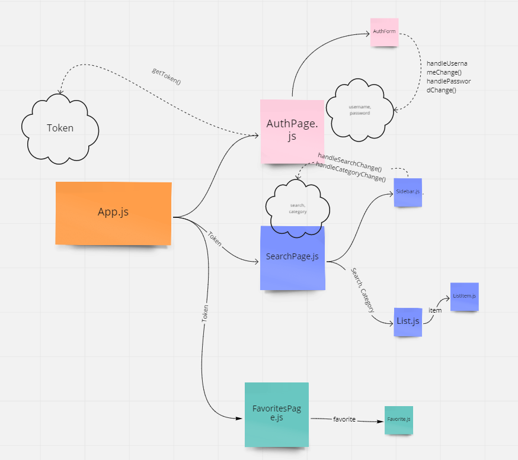

Anime site front end

# Pages 
- Welcome page
- Auth Page
- Search/Display(protected)
- Favorites page(protected)

# Components

- App.js
    - React Router with pritvate routes
- AuthPage.js
    - AuthForm.js(pass in callback and type as props)
- SearchPage.js
    - Sidebar.js(callback with search params/possibly category)
    - List.js
    - ListItem.js
- FavoritesPage.js
    - Favorite.js

- Spinner.js

# Files

- api-utils.js
- local-storage-utils.js

